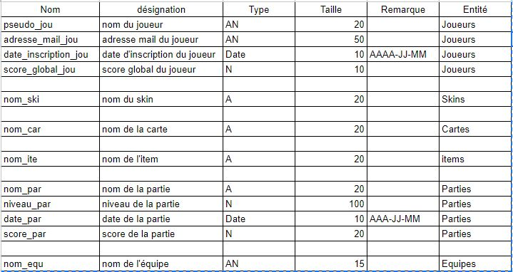
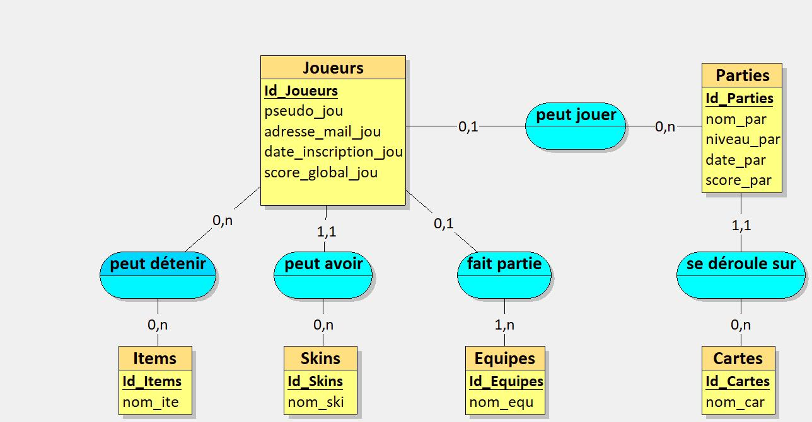
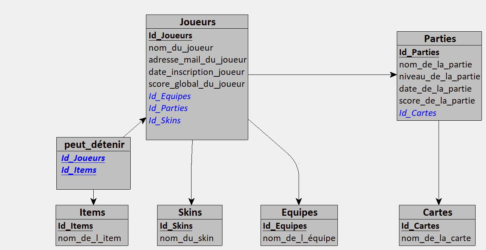

# Conception-et-modalisation-base-de-donn-es

### TP réalisé avec Chantal GUILLAUME

### Dictionnaire des données


### MCD



### MLD

```
Cartes = (Id_Cartes COUNTER, nom_de_la_carte VARCHAR(20));
Parties = (Id_Parties COUNTER, nom_de_la_partie VARCHAR(20), niveau_de_la_partie INT, date_de_la_partie DATE, score_de_la_partie INT, #Id_Cartes);
Equipes = (Id_Equipes COUNTER, nom_de_l_équipe VARCHAR(15));
Skins = (Id_Skins COUNTER, nom_du_skin VARCHAR(20));
Items = (Id_Items COUNTER, nom_de_l_item VARCHAR(20));
Joueurs = (Id_Joueurs COUNTER, nom_du_joueur VARCHAR(20), adresse_mail_du_joueur VARCHAR(50), date_inscription_joueur DATE, score_global_du_joueur INT, #Id_Equipes*, #Id_Parties*, #Id_Skins);
peut_détenir = (#Id_Joueurs, #Id_Items);

```

### MPD



### SQL

```SQL
CREATE TABLE Cartes(
   Id_Cartes COUNTER,
   nom_de_la_carte VARCHAR(20),
   PRIMARY KEY(Id_Cartes)
);

CREATE TABLE Parties(
   Id_Parties COUNTER,
   nom_de_la_partie VARCHAR(20),
   niveau_de_la_partie INT,
   date_de_la_partie DATE,
   score_de_la_partie INT,
   Id_Cartes INT NOT NULL,
   PRIMARY KEY(Id_Parties),
   FOREIGN KEY(Id_Cartes) REFERENCES Cartes(Id_Cartes)
);

CREATE TABLE Equipes(
   Id_Equipes COUNTER,
   nom_de_l_équipe VARCHAR(15),
   PRIMARY KEY(Id_Equipes)
);

CREATE TABLE Skins(
   Id_Skins COUNTER,
   nom_du_skin VARCHAR(20),
   PRIMARY KEY(Id_Skins)
);

CREATE TABLE Items(
   Id_Items COUNTER,
   nom_de_l_item VARCHAR(20),
   PRIMARY KEY(Id_Items)
);

CREATE TABLE Joueurs(
   Id_Joueurs COUNTER,
   nom_du_joueur VARCHAR(20),
   adresse_mail_du_joueur VARCHAR(50),
   date_inscription_joueur DATE,
   score_global_du_joueur INT,
   Id_Equipes INT,
   Id_Parties INT,
   Id_Skins INT NOT NULL,
   PRIMARY KEY(Id_Joueurs),
   FOREIGN KEY(Id_Equipes) REFERENCES Equipes(Id_Equipes),
   FOREIGN KEY(Id_Parties) REFERENCES Parties(Id_Parties),
   FOREIGN KEY(Id_Skins) REFERENCES Skins(Id_Skins)
);

CREATE TABLE peut_détenir(
   Id_Joueurs INT,
   Id_Items INT,
   PRIMARY KEY(Id_Joueurs, Id_Items),
   FOREIGN KEY(Id_Joueurs) REFERENCES Joueurs(Id_Joueurs),
   FOREIGN KEY(Id_Items) REFERENCES Items(Id_Items)
);
```
### Exercice planètes
 
   ```SQL
1.
   CREATE DATABASE `solar_system`;
    
   CREATE TABLE planetes (
    id INT PRIMARY KEY,
    nom VARCHAR(255) NOT NULL,
    distance INT NOT NULL,
    periode_de_revolution INT NOT NULL
   );

INSERT INTO `planete`(`id`, `nom`, `distance`, `periode_de_revolution`) VALUES (1, 'Jupiter', 778330, 4332.71);
INSERT INTO `planete`(`id`, `nom`, `distance`, `periode_de_revolution`) VALUES (2, 'Saturn', 1429400, 10759.5);
INSERT INTO `planete`(`id`, `nom`, `distance`, `periode_de_revolution`) VALUES (3, 'Uranus', 2870990, 30685);
INSERT INTO `planete`(`id`, `nom`, `distance`, `periode_de_revolution`) VALUES (4, 'Neptune', 4504300, 60190);
INSERT INTO `planete`(`id`, `nom`, `distance`, `periode_de_revolution`) VALUES (5, 'Pluto', 5913520, 90550);
  ```
3.
    ```SQL
  CREATE TABLE planet_type (
  id int PRIMARY KEY NOT NULL AUTO_INCREMENT
  , type varchar(255) NOT NULL
);
  ```

### Radars d'exercice
1.
```SQL
SELECT Département, SUM(Nombre_de_dossiers_dinfractions) AS total_dossiers_infractions
FROM radars
GROUP BY Département;
```
2.
```SQL
select Nom_de_la_voie, sum(Nombre_de_dossiers_dinfractions) as Total_dossier_infractions 
from radars where Nom_de_la_voie like 'A%' and substr(Nom_de_la_voie,2,1) between 1 and 9
group by Nom_de_la_voie order by Total_dossier_infractions desc limit 1;
```
```SQL
SELECT Nom_de_la_voie, SUM(Nombre_de_dossiers_dinfractions) AS total_dossiers_infractions_autoroute
FROM radars
WHERE  Nom_de_la_voie LIKE 'RD%'
GROUP BY Nom_de_la_voie 
ORDER BY total_dossiers_infractions_autoroute DESC
LIMIT 1;
```
3.
```SQL
SELECT
    id,
    Nom_de_la_voie,
    AVG(Nombre_de_dossiers_dinfractions) AS moyenne_infractions_par_radar,
    AVG(Nombre_de_dossiers_dinfractions) * (YEAR(CURRENT_DATE) - YEAR(date_de_mise_en_service) + 1) AS total_infractions_sur_duree_service
FROM
    radars
GROUP BY
    id, Nom_de_la_voie
ORDER BY
    total_infractions_sur_duree_service DESC;
```
